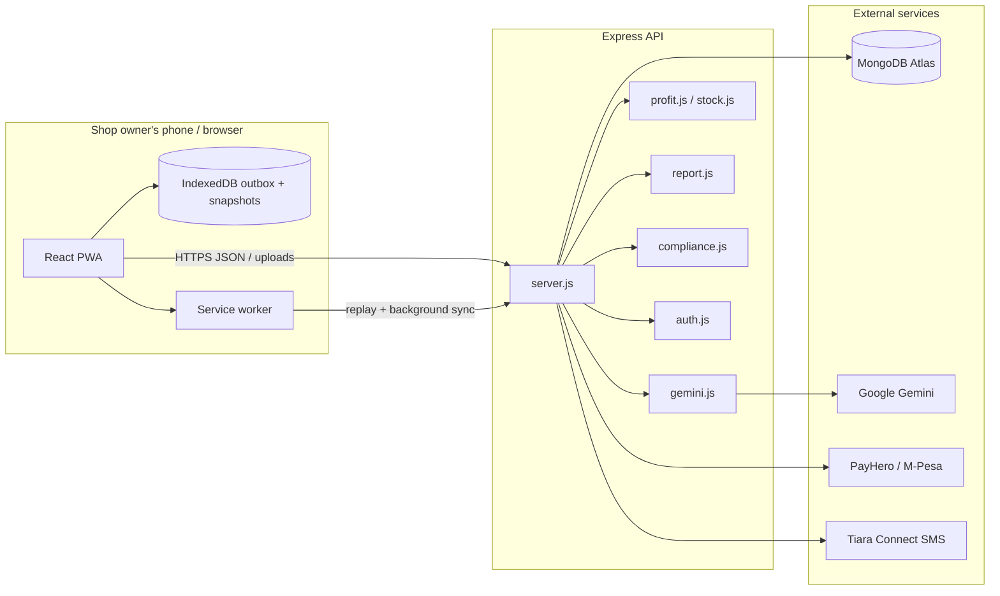

# BiasharaBot

A shop assistant for Kenyan dukas. The owner records sales and purchases by voice, typed Swahili/English, or a supplier receipt photo. The app keeps a daily ledger, a weekly till slip (English or Kiswahili), stock costs for item-level profit, and a KRA/county compliance checklist. M-Pesa STK and SMS go out through PayHero and Tiara Connect. Gemini reads messy text, audio, and receipts — it never invents tax figures.

This repository is a **React PWA** (`frontend/`) talking to an **Express + MongoDB API** (`backend/`).

## What the owner can do

| Area | What it does |
| --- | --- |
| **Register / log in** | Create a shop once, then log back in with phone or email. Passwords can be shown while typing. |
| **Daily ledger** | Voice note or typed line (“sold 3 kg sugar 200”). Works offline; the phone uploads later. |
| **Stock** | Option A: photograph a receipt (Gemini extracts lines). Option B: pick a file. Or type the purchase. Review before save. |
| **Weekly till slip** | Cash-basis totals plus item-level gross profit from stock unit costs. SMS in the owner’s language. |
| **M-Pesa** | STK push through PayHero; webhooks mark a sale paid. |
| **Compliance** | Unlock with the admin password. Checklist for PIN, TOT, VAT, eTIMS, county permit, income tax — rules live in `backend/compliance-config.js`, not in the AI. |
| **Settings** | Report language (en/sw) and shop profile. |

## Run locally

```bash
npm run install:all
```

Create `backend/.env` from `backend/.env.example`. **Required:** `MONGODB_URI`. Gemini, PayHero, and Tiara can stay `mock` for a UI tour, or take real keys (never commit `.env`).

```bash
npm run dev
```

- API: http://localhost:5000  
- App: http://localhost:5173  

Point the dashboard at this machine with `frontend/.env`:

```
VITE_API_BASE=http://localhost:5000/api
```

Restart Vite after changing that file.

```bash
npm test
```

## System architecture



**Frontend.** Vite + React, installed as a PWA. Typed and voice entries can be queued in IndexedDB when there is no signal. Snapshots keep the ledger and till slip readable offline. The browser never holds API keys.

**Backend.** One Express process. `dotenv` loads `backend/.env`. Routes live mainly in `server.js`; compliance sessions are in `compliance-api.js`. Passwords are bcrypt hashes. Login issues a session token (not stored in Mongo). Profile `PATCH` requires that token.

**Data.** MongoDB collections: businesses, entries (sales/purchases/expenses/credit), stock lots, compliance notices (one SMS per obligation window).

**AI boundary.** Gemini parses text, audio, and receipts, and may translate unknown-language *labels*. Amounts, KES, item names, and tax thresholds are formatted and calculated in Node. English and Swahili report copy is templated in `report-labels.js`.

**Payments and SMS.** PayHero STK + webhooks. Tiara sends the weekly slip and compliance reminders. Mock keys log to the server console instead of charging.

**When an SMS goes out.** Opening the till slip never sends one. The till slip is texted only by the scheduled weekly job (once per shop per week, skipped for shops with no entries) or when the logged-in owner taps *Send this till slip* (3 an hour). It always goes to the phone saved on the shop. `services/sms.js` refuses non-Kenyan-mobile numbers, reads success from Tiara's own status (it answers HTTP 200 even when it rejects a message), folds text into GSM-7 so it is billed at 153 characters per part, caps a message at 6 parts, and times out after 15 s. Each attempt is recorded in `reportdeliveries`; compliance reminders in `compliancenotices`.

### Scheduled SMS

`backend/scheduler.js` runs inside the API with `node-cron`, in Kenya time:

| Job | Env var | Default |
| --- | --- | --- |
| Weekly till slip | `REPORT_SMS_CRON` | `0 20 * * 0` (Sunday 20:00) |
| Credit reminders | `CREDIT_REMINDER_CRON` | `0 */6 * * *` (every 6 hours) |

Set either to `off` to disable it. Re-running the weekly job in the same week is safe; only failed sends are retried (up to 3 attempts).

**Demo (e.g. every 2 minutes):** in `backend/.env` set `REPORT_SMS_CRON=*/2 * * * *`, `SMS_DEMO_SHOP=<your shop id>`, `SMS_DEMO_REPEAT=1`, then restart. Only that shop is texted, even with no sales this week, and it stops after `SMS_DEMO_MAX_SENDS` (default 3) so the demo cannot drain the Tiara balance. Remove the lines afterwards.

The in-process timer only fires while the server is awake. On a free Render service that sleeps when idle, set `REPORT_SMS_CRON=off` and trigger the job from outside instead:

- **Render Cron Job:** root `backend`, command `npm run job:weekly-reports`, schedule `0 17 * * 0` (17:00 UTC = 20:00 EAT), same env vars as the API.
- **External pinger** (cron-job.org, GitHub Actions…): set `CRON_SECRET` on the API, then `POST /api/jobs/weekly-reports` with header `X-Cron-Secret: <secret>`. It answers `202` immediately and runs in the background.

### Main API groups

| Path | Role |
| --- | --- |
| `POST /api/business` | Register (returns public profile + session token) |
| `POST /api/business/login` | Log in with phone or email |
| `POST /api/business/logout` | Drop the session |
| `PATCH /api/business/:id` | Update language/profile (session required) |
| `POST /api/entries/text` · `/voice` | Log a transaction |
| `POST /api/stock/parse` · `/confirm` · `/manual` | Receipt + stock |
| `GET /api/reports/weekly` | Till slip (read-only, never sends SMS) |
| `POST /api/business/:id/report-sms` | Text the till slip to the shop's phone (session required) |
| `POST /api/jobs/weekly-reports` | Scheduled weekly SMS run (`X-Cron-Secret` required) |
| `POST /api/payments/stk` | M-Pesa prompt |
| `/api/compliance/*` | Password-gated tax checklist |

## Security notes

- Passwords: min 8 characters, bcrypt, never returned to the client.  
- Login / admin unlock: same error for unknown shop vs wrong password; rate-limited.  
- Show/Hide on password fields is local to the browser — it does not send the secret anywhere extra.  
- Keep `.env` out of git. Rotate keys if they were pasted in chat or a ticket.

## Deploy

Typical split: frontend on Vercel (`frontend/` as root), API on Render. Set the same env vars on the host. Production `VITE_API_BASE` must be the public API `/api` URL and is baked in at build time. See [frontend/README.md](frontend/README.md) for PWA hosting rules (HTTPS, `sw.js` at site root).
